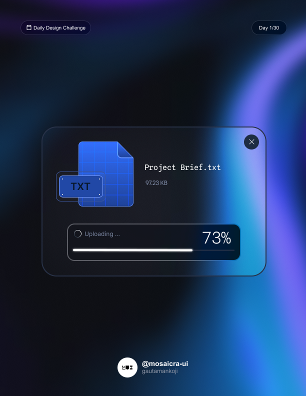

Here’s a similar structure for a **File Uploader UI Page**:

# File Uploader UI - Mosaicra UI

This repository contains a beautifully designed **File Uploader UI** for the **Mosaicra UI** library. The design is minimal, intuitive, and offers a seamless file upload experience. It's perfect for use in web applications that require file management or submission functionalities.

## Preview

Here are the screenshots of the file uploader page:

## Features

- **Drag-and-Drop Support**: Users can drag and drop files into the upload area for quick and easy uploading.
- **Progress Indicators**: Real-time upload progress bars for each file, ensuring users are informed throughout the process.
- **Multiple File Upload**: Supports simultaneous uploading of multiple files, optimizing workflow efficiency.
- **File Type Validation**: Only allows specific file types, ensuring that users upload appropriate formats.
- **Responsive Design**: Adaptable to various screen sizes for mobile and desktop users.
- **Modern Aesthetic**: Clean and minimal interface with a focus on user-friendliness.

## Download

Click the button below to download the Figma design file:

[<kbd>Download</kbd>](./file-uploader.fig)

## Contributing

Contributions are welcome! If you'd like to improve the UI or add new features, feel free to submit a pull request.

## License

This project is licensed under the MIT License. See the [LICENSE](./LICENSE) file for details.

---

Designed By <a href="https://github.com/gautamankoji" target="_blank">gautamankoji</a>

