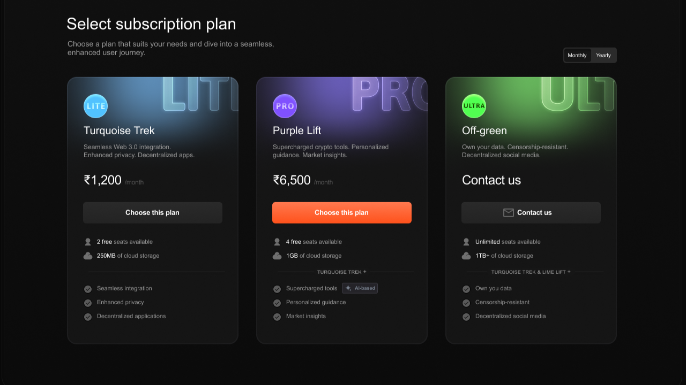
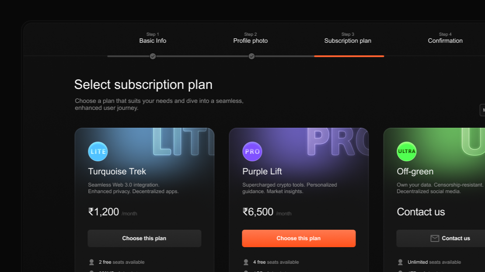

# Subscription Page UI - Mosaicra UI

A beautifully designed **Subscription Page UI** for the **Mosaicra UI** library. The design is clean, modern, and built with user experience in mind, offering an ideal interface for subscription-based services.

## Preview

Here are the screenshots of the subscription page:

## Features

- **Responsive Design**: The page adapts seamlessly to various screen sizes, providing a consistent user experience across all devices.
- **Modern Aesthetic**: Minimalist and sleek design elements are used to create a professional look.
- **Customizable Layout**: Easily modify colors, fonts, and layout according to your project's needs.
- **User-Friendly Interface**: Designed to offer an intuitive user experience, making it easy for visitors to subscribe.
  
## Download

Click the button below to download the Figma design file:

[<kbd>Download</kbd>](./subscription-page.fig)

## Contributing

Contributions are welcome! If you'd like to improve the UI or add new features, feel free to submit a pull request.

## License

This project is licensed under the MIT License. See the [LICENSE](./LICENSE) file for details.

---

Designed By <a href="https://github.com/gautamankoji" target="_blank">gautamankoji</a>

